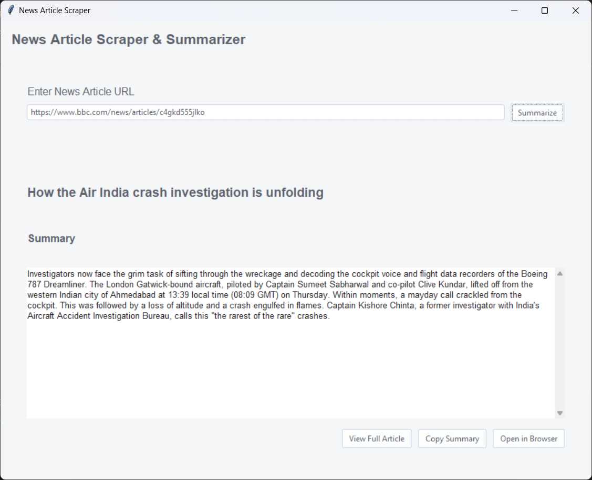

# 📰 Article Summary App

A Python-based desktop application that fetches and summarizes news articles from a given URL. Built using **Tkinter** for the GUI and **newspaper3k** for article scraping and NLP-based summarization.

> 🎓 Developed as a personal learning project by a college student to explore GUI development, web scraping, and natural language processing in Python.

---

## 📌 Features

- 🔗 Enter any news/article URL
- 🧠 Automatically extracts and summarizes articles using `newspaper3k` + transformers
- 🖥️ Clean and responsive Tkinter interface
- 📋 One-click summary copy feature
- ⚡ Lightweight, fast, and beginner-friendly

---

## 📸 Screenshot



---

## 🚀 Getting Started

### 🔧 Requirements

Make sure you have Python installed (preferably 3.7 or higher). Then install the required packages:

```bash
pip install -r requirements.txt
```

### ▶️ Run the App

```bash
python main.py
```

---

## 📁 Project Structure

```plaintext
Article-Summary/
├── app.py                # Main Tkinter app
├── summarize.py          # Scraping + Summarizing logic
├── requirements.txt      # Required Python packages
├── assets/
│   └── screenshot.png    # App screenshot
```

---

## 📦 Built With

- [Python](https://www.python.org/)
- [Tkinter](https://docs.python.org/3/library/tkinter.html) – GUI library
- [newspaper3k](https://github.com/codelucas/newspaper) – Article extraction and summarization
- [transformers](https://huggingface.co/docs/transformers/en/index) – For article summarization using pretrained NLP models


---

## 🧠 What I Learned

- How to build desktop GUIs in Python using Tkinter
- How to use NLP for summarizing content
- How to use transformers for summarizing context
- Integrating scraping and GUI logic in one project

## 🤝 Contributing

Contributions are welcome!

If you find a bug or have a suggestion, feel free to [open an issue](https://github.com/ayannotfound/Article-Summary/issues) or submit a pull request.

---

## 📜 License

This project is licensed under the MIT License.

---

## 📫 Contact

Created by [@ayannotfound](https://github.com/ayannotfound)
Check out my other project 👉 [Weather Web App](https://github.com/ayannotfound/Weather)

> Feel free to fork the repo, leave a ⭐, or reach out with feedback!